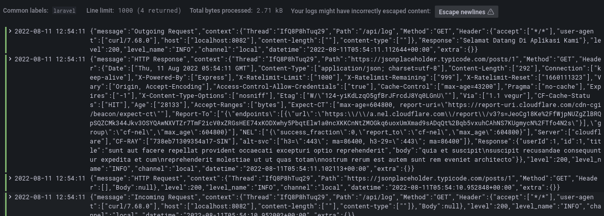

# Publish Laravel Log to Grafana

## How To Run

1. sudo docker-compose up -d
2. Add loki to grafana data source with http://loki:3100
3. curl localhost/api/log 

Reference Links:
- https://github.com/minhajul/laravel-grafana
- https://computingforgeeks.com/forward-logs-to-grafana-loki-using-promtail/
- https://phoenixnap.com/kb/create-helm-chart
